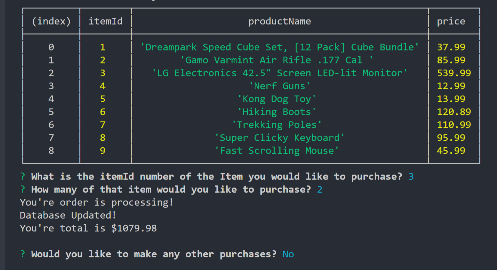
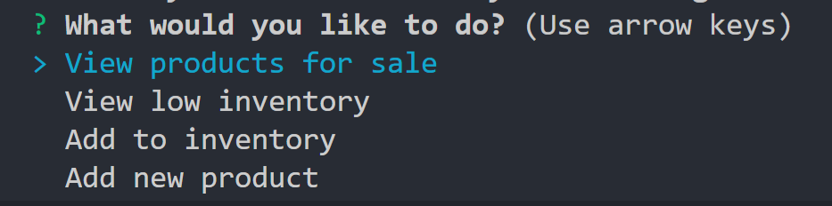
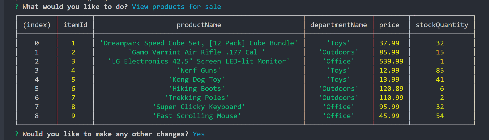
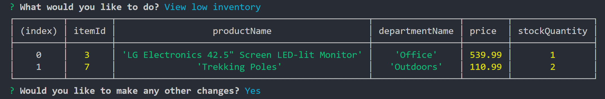
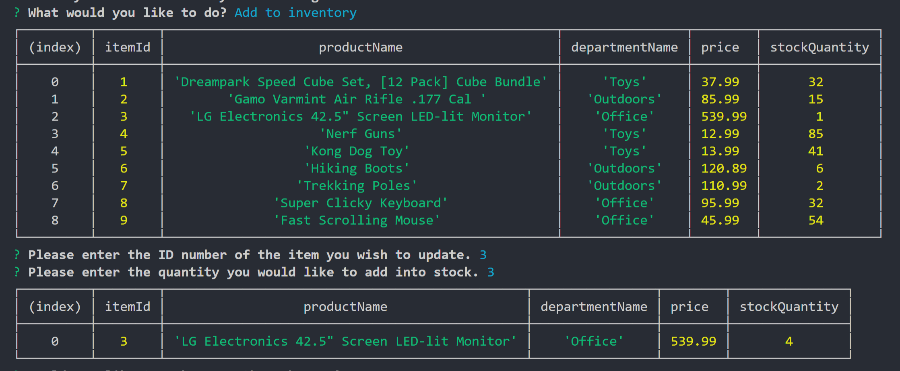
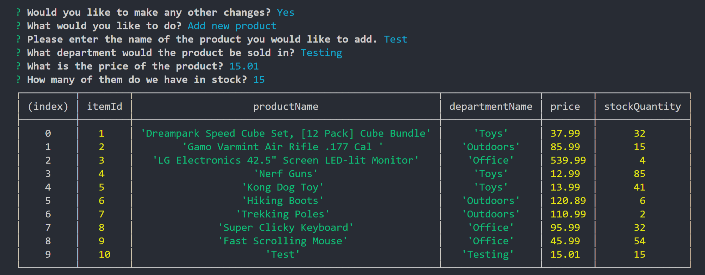

# SQLStoreDB

## What does this project do?

This is a command line interface app that simulates a storefront.
It connects to a local database and updates it through 'purchases' and 'restocking'.
You can also add new products into the database.

Here you can select the Id of the product you would like to purchase and the quantity.
If there are enough in stock your purchase will complete, otherwise you will be informed that your order can't be fulfilled.

Here you can view the store from a manager's perspective, showing you all of your available options.

The first selection shows all of the products currently in the store and their quantities.

Next we have the option to view only the items that are currently low on inventory.

Then we have the option to add to the inventory by selecting the Id of the item and how many you would like to add to the stock.

And finally we have the ability to add a new product to the storefront.

## Why is this project useful?

It is useful for learning about the basics of how databases work and interacting with them.

## How can users get started with the project?

Simply create the database with the included SQL seed file and run in the terminal.

## Where can users get help with your project?

Please contact me if you need any assistance.

## Who maintains and contributes to the project?

I am the sole contributer.
